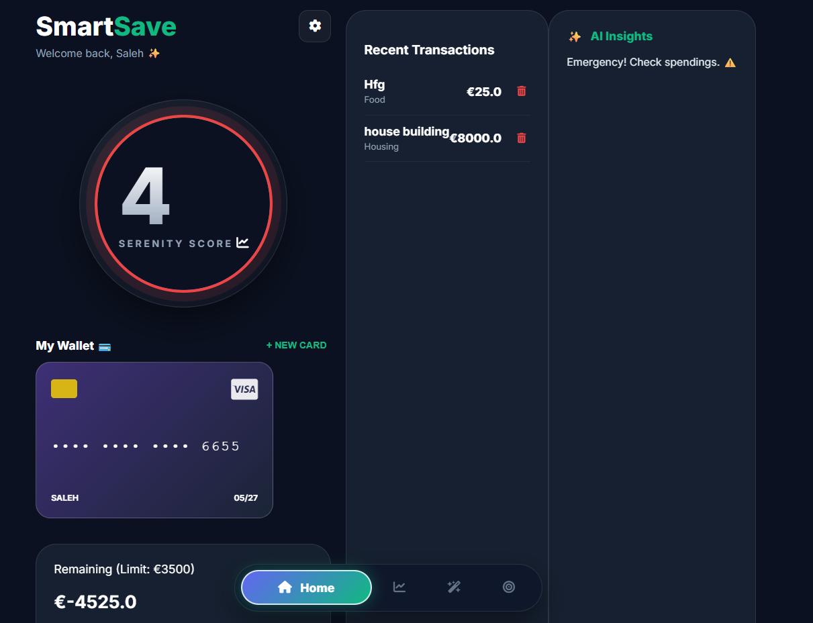

# ✨ SmartSave - AI-Powered Personal Finance 💸



> **Current Status:** This project is under active development. I am currently focusing on AI integration and dashboard UI enhancements. New features are pushed daily! 

**SmartSave** is not just a simple budget manager; it is an **intelligent financial coach**. Using **Artificial Intelligence**, the application analyzes your receipts, tracks your spending in real-time, and automatically adjusts your bank card balances.

---

## 🚀 Key Features

* **🤖 AI Receipt Scanner**: Take a photo of your receipt and the AI automatically extracts the merchant, total amount, and individual items.
* **💳 Digital Wallet Manager**: Manage multiple cards (Revolut, Attijari, etc.) with personalized visuals and automatic balance tracking.
* **📊 Serenity Score**: A unique algorithm that calculates your financial health in real-time.
* **💸 Smart Transactions**: Every expense is linked to a specific card for ultra-precise accounting.
* **📱 Mobile-First Design**: A modern "Glassmorphism" interface optimized for smartphone use.

---

## 🏗️ Architecture & Data Flow

* **Frontend (View)**: Interface built with **Jinja2**, **HTML5**, and **CSS3** (Glassmorphism). It sends `JSON` requests to the server via `fetch()`.
* **Backend (Controller)**: **FastAPI** receives requests, processes logic (such as balance calculations or AI scanning), and communicates with the database.
* **Database (Model)**: **SQLAlchemy** manages the `Transaction` and `BankCard` tables, ensuring the persistence of user data.

### 📂 Main File Structure
* `main.py`: Application entry point and server configuration.
* `routes.py`: Contains all endpoint logic (API endpoints) like `/add-transaction` or `/add-card`.
* `models.py`: Defines the data structure (columns, types, relationships).
* `templates/index.html`: The main interactive dashboard.
* `static/css/style.css`: The entire graphic charter and premium animations.

---

## 🔄 Transaction Lifecycle

When an expense is added:
1. **Client Request**: The client sends the `amount` and the `card_id`.
2. **Database Retrieval**: The server retrieves the corresponding card from the database.
3. **Balance Update**: A subtraction operation is performed on `card.balance`.
4. **Atomic Commit**: The transaction and the new balance are validated (`commit`) simultaneously to prevent any calculation errors.

---

## 📱 Mobile Access

1. Ensure your PC and your phone are on the **same Wi-Fi network**.
2. Launch the server by allowing external connections:
   ```bash
   uvicorn main:app --host 0.0.0.0 --port 8000
 ### 🛠️ Common Fixes
If you encounter a `rebase-merge` error on Windows, run:
`Remove-Item -Force -Recurse .git/rebase-merge`